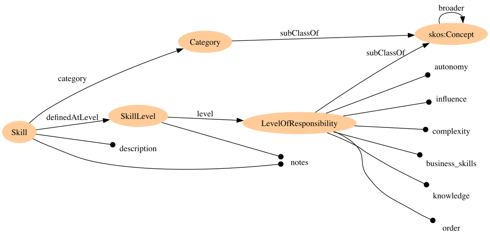

# SFIA in RDF

This script converts in RDF the SFIA spreadsheet provided
at https://sfia-online.org/en/sfia-8/documentation/sfia-skills-responsibilities-xls/view.
The conversion is based on the model below.

## Python setup

(Assuming you have `python3` on your system)

This repo uses [`poetry`](https://python-poetry.org/docs) as package manager. </br>

- Install poetry: ```curl -sSL https://install.python-poetry.org | python3 -```
- run `poetry install`

## Usage

- In `sfia_rdf/convert_sfia.py`, change SFIA_SPREADSHEET and OUTPUT to your needs
- run it with `poetry run python3 sfia_rdf/convert_sfia.py`

The output will be an RDF Turtle file.

## The Model


