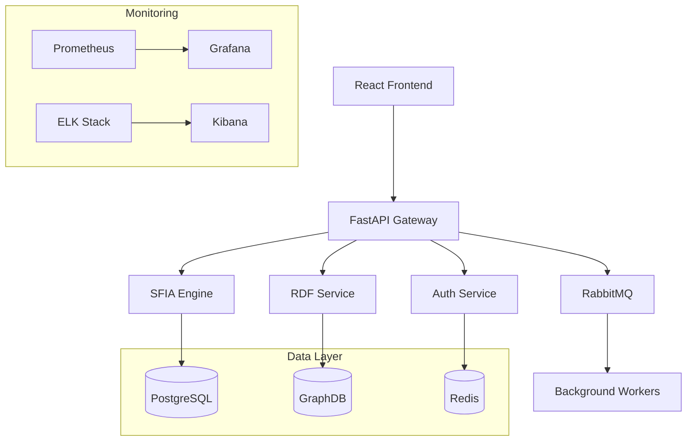

# IntelliSFIA Framework

[](https://www.python.org/downloads/)
[](LICENSE)
[](SFIA_LICENSE_NOTE)
[](https://neo4j.com/)
[](https://github.com/joaomdmoura/crewAI)
[](#multi-llm-providers)

> **Intelligent Skills Framework for the Information Age**  
> *Enterprise-grade SFIA framework implementation with AI-powered assessment, semantic knowledge graphs, and real-time analytics*

## 🚀 Quick Start

### One-Command Demo
```bash
git clone https://github.com/yasir2000/IntelliSFIA.git
cd IntelliSFIA
python demo.py
```

### Production Deployment
```bash
# Docker Compose (Single Server)
docker-compose -f deployment/docker-compose.prod.yml up -d

# Kubernetes (Multi-Server)
kubectl apply -f deployment/kubernetes/intellisfia-app.yaml
```

## ⚖️ IMPORTANT: SFIA Licensing Requirements

> **🚨 MANDATORY READING FOR ALL DEVELOPERS AND USERS**

**SFIA (Skills Framework for the Information Age) is the intellectual property of The SFIA Foundation.** Any use of SFIA requires proper licensing and acknowledgment.

### **📋 Licensing Summary**
- ✅ **Personal & Educational Use**: Free of charge
- ✅ **Small Organizations**: Free of charge  
- ⚠️ **Large Organizations**: Modest licensing fees may apply
- 💼 **Commercial Exploitation**: Licensing fees required

### **🔗 Essential Documentation**
- 📄 **[SFIA Licensing Details](SFIA_LICENSE_NOTE)** - **READ THIS FIRST**
- 🌐 **[Official SFIA Registration](https://sfia-online.org/register)** - Required for usage
- ⚖️ **[Full License Terms](https://sfia-online.org/license)** - Complete legal terms

### **⚠️ Developer Obligations**
When using this framework, you **MUST**:

1. **📝 Acknowledge SFIA Foundation** in all publications/applications containing SFIA content
2. **🔗 Register for SFIA License** at https://sfia-online.org/register
3. **📖 Include Required Attribution**: 
   ```
   "This publication contains information from the Skills Framework 
   for the Information Age with the permission of the SFIA Foundation."
   ```
4. **🚫 Prohibition**: Do NOT use SFIA to create rival frameworks
5. **💼 Commercial Usage**: Contact SFIA Foundation for commercial licensing

### **🚨 Legal Compliance**
- **Copyright**: All SFIA content remains property of The SFIA Foundation
- **Distribution**: Reproduction requires explicit permission
- **Attribution**: Must acknowledge SFIA Foundation in all derived works
- **Non-Competition**: Cannot be used to create competing frameworks

**📞 Contact SFIA Foundation**: For licensing questions or commercial usage  
**🌐 Official Website**: https://www.sfia-online.org/

---

## 🌟 Key Features

### **Complete SFIA 9 Framework Integration**
- ✅ **147 Skills** with detailed descriptions and progression levels
- ✅ **16 Attributes** covering technical and behavioral competencies
- ✅ **21 Levels** from entry-level to strategic leadership
- ✅ **6 Categories** with organized skill taxonomies
- ✅ **Interactive Assessment** with AI-powered recommendations

### **Enterprise-Grade Architecture**
- 🏗️ **Microservices Architecture** with Docker & Kubernetes
- 🔐 **JWT Authentication** with role-based access control
- 📊 **Real-time Analytics** with comprehensive dashboards
- 🌐 **Multi-tenant Support** for enterprise organizations
- 📈 **Auto-scaling** based on demand and resource usage

### **AI-Powered Intelligence**
- 🤖 **Multi-Agent AI System** for intelligent skill assessment
- 🧠 **Semantic Knowledge Graph** with RDF triple store
- 🔍 **Natural Language Queries** for skill exploration
- 📋 **Automated Recommendations** for career progression
- 🎯 **Skill Gap Analysis** with personalized learning paths

### **Modern Web Application**
- ⚛️ **React TypeScript Frontend** with Material-UI
- 🚀 **FastAPI Backend** with comprehensive REST API
- 📱 **Responsive Design** optimized for all devices
- 🎨 **Interactive Visualizations** for data exploration
- 🔄 **Real-time Updates** with WebSocket connectivity

## 📊 Architecture Overview



## 🛠️ Technology Stack

### **Backend Services**
- **FastAPI** - High-performance Python API framework
- **PostgreSQL 15** - Primary database with JSONB support
- **Redis 7** - Caching and session management
- **GraphDB** - RDF triple store for semantic data
- **RabbitMQ** - Message queue for async processing

### **Frontend Application**
- **React 18.2.0** - Modern JavaScript framework
- **TypeScript** - Type-safe development
- **Material-UI** - Google's design system
- **D3.js** - Data visualization library
- **React Query** - Server state management

### **Infrastructure**
- **Docker & Docker Compose** - Containerization
- **Kubernetes** - Container orchestration
- **Nginx** - Load balancing and reverse proxy
- **Prometheus & Grafana** - Monitoring and alerting
- **ELK Stack** - Centralized logging

### **AI & Machine Learning**
- **CrewAI** - Multi-agent orchestration
- **OpenAI GPT-4** - Natural language processing
- **Anthropic Claude** - Advanced reasoning
- **Local LLMs** - Privacy-focused inference
- **spaCy** - Text processing and NLP

## 📈 Business Capabilities

### **For Organizations**
- 🏢 **Enterprise Integration** - Connect with LDAP, SAP, Workday
- 📊 **Workforce Analytics** - Real-time skill visibility
- 🎯 **Strategic Planning** - Skill gap analysis and forecasting
- 📋 **Compliance Reporting** - Automated competency tracking
- 💰 **ROI Measurement** - Training effectiveness analysis

### **For Individuals**
- 👤 **Personal Skill Portfolio** - Comprehensive competency tracking
- 🛤️ **Career Pathways** - AI-recommended progression routes
- 📚 **Learning Recommendations** - Personalized skill development
- 🎖️ **Certification Tracking** - Professional development history
- 🔍 **Skill Matching** - Role and opportunity alignment

### **For Teams**
- 👥 **Team Composition Analysis** - Skill diversity insights
- 🎯 **Project Skill Requirements** - Competency planning
- 📈 **Collective Skill Growth** - Team development tracking
- 🤝 **Collaboration Optimization** - Skill complement identification
- 📊 **Performance Correlation** - Skills vs. outcomes analysis

## 🔧 Installation & Setup

### **Prerequisites**
- Python 3.11+
- Node.js 18+
- Docker & Docker Compose
- PostgreSQL 15+ (for local development)

### **Development Setup**
```bash
# 1. Clone the repository
git clone https://github.com/yasir2000/IntelliSFIA.git
cd IntelliSFIA

# 2. Set up Python environment
python -m venv venv
source venv/bin/activate  # Windows: venv\Scripts\activate
pip install -e .

# 3. Install frontend dependencies
cd sfia_ai_framework/frontend
npm install

# 4. Configure environment
cp .env.example .env
# Edit .env with your configuration

# 5. Initialize database
python -m sfia_ai_framework.data.sfia9_data_processor

# 6. Start services
# Backend
python -m sfia_ai_framework.web.app

# Frontend (new terminal)
cd sfia_ai_framework/frontend && npm start
```

### **Production Deployment**
```bash
# Docker Compose
docker-compose -f deployment/docker-compose.prod.yml up -d

# Kubernetes
kubectl apply -f deployment/kubernetes/intellisfia-app.yaml

# Access the application
open http://localhost (Docker) or https://your-domain.com (K8s)
```

## 🎮 Usage Examples

### **Basic SFIA Assessment**
```python
from sfia_ai_framework import SFIAFramework

# Initialize framework
sfia = SFIAFramework()

# Assess individual skills
assessment = sfia.assess_skills(
    user_id="john.doe@company.com",
    role="Software Developer",
    experience_years=3
)

# Get recommendations
recommendations = sfia.get_recommendations(assessment)
print(f"Recommended learning path: {recommendations.next_steps}")
```

### **Enterprise Integration**
```python
from sfia_ai_framework.enterprise import IntegrationManager

# Connect to enterprise systems
integration = IntegrationManager()
integration.connect_ldap("ldap://company.com")
integration.connect_hrms("workday_api_endpoint")

# Sync organizational data
org_data = integration.sync_organization_structure()
skill_gaps = integration.analyze_skill_gaps()
```

### **Multi-Agent AI Assessment**
```python
from sfia_ai_framework.core.enhanced_agents import SFIAAgentCrew

# Create AI agent crew
crew = SFIAAgentCrew()

# Run comprehensive assessment
result = crew.assess_portfolio(
    portfolio_data=portfolio,
    assessment_type="comprehensive",
    include_recommendations=True
)
```

## 📊 Monitoring & Analytics

### **Key Metrics**
- **User Engagement**: Active sessions, assessment completions
- **System Performance**: Response times, error rates, throughput
- **Business Impact**: Skill development progress, career advancement
- **Technical Health**: Service availability, resource utilization

### **Dashboards Available**
- 📈 **Executive Dashboard** - High-level business metrics
- 🔧 **Operations Dashboard** - System health and performance
- 👥 **HR Analytics** - Workforce skill insights
- 🎯 **Individual Progress** - Personal development tracking

### **Access Monitoring**
- **Grafana**: http://localhost:3001 (admin/admin)
- **Kibana**: http://localhost:5601
- **Prometheus**: http://localhost:9090
- **Jaeger**: http://localhost:16686

## 🔐 Security & Compliance

### **Security Features**
- 🔒 **TLS 1.3 Encryption** for all communications
- 🎫 **JWT Authentication** with refresh token rotation
- 🛡️ **Role-Based Access Control** (RBAC)
- 🔍 **API Rate Limiting** and DDoS protection
- 📋 **Comprehensive Audit Logging**

### **Compliance Standards**
- ✅ **GDPR** - Data privacy and protection
- ✅ **SOC 2** - Security controls and procedures
- ✅ **ISO 27001** - Information security management
- ✅ **OWASP Top 10** - Web application security

## 🚀 Performance & Scalability

### **Performance Characteristics**
- **1,000+ Concurrent Users** (single server)
- **10,000+ Users** (Kubernetes cluster)
- **< 200ms API Response Time** (95th percentile)
- **99.9% Uptime** with automated failover

### **Scaling Architecture**
- **Horizontal Scaling**: Auto-scaling pods based on CPU/memory
- **Database Scaling**: Read replicas and connection pooling
- **Caching Strategy**: Multi-layer caching with Redis
- **CDN Integration**: Global content delivery

## 🤝 Contributing

We welcome contributions! Please see our [Contributing Guide](CONTRIBUTING.md) for details.

### **Development Workflow**
1. Fork the repository
2. Create a feature branch (`git checkout -b feature/amazing-feature`)
3. Commit your changes (`git commit -m 'Add amazing feature'`)
4. Push to the branch (`git push origin feature/amazing-feature`)
5. Open a Pull Request

### **Code Standards**
- Python: Follow PEP 8, use Black formatter
- TypeScript: Follow Airbnb style guide
- Documentation: Update docs for new features
- Testing: Maintain >90% code coverage

## 📚 Documentation

- 📖 **[API Documentation](http://localhost:8000/docs)** - Interactive Swagger UI
- 🏗️ **[Architecture Guide](docs/architecture.md)** - System design details
- 🚀 **[Deployment Guide](deployment/DEPLOYMENT.md)** - Production setup
- 🎯 **[User Guide](docs/user-guide.md)** - Feature documentation

## 🆘 Support

### **Getting Help**
- 📧 **Email**: support@intellisfia.com
- 💬 **Discord**: [IntelliSFIA Community](https://discord.gg/intellisfia)
- 🐛 **Issues**: [GitHub Issues](https://github.com/yasir2000/IntelliSFIA/issues)
- 📚 **Docs**: [Documentation Site](https://docs.intellisfia.com)

### **Community**
- 🌟 **Star** the repository if you find it useful
- 🐦 **Follow** us on [Twitter](https://twitter.com/intellisfia)
- 💼 **Connect** on [LinkedIn](https://linkedin.com/company/intellisfia)

## 📝 License & Legal

### **Project License**
This project's code is licensed under the Apache License 2.0 - see the [LICENSE](LICENSE) file for details.

### **SFIA Framework License** 
⚠️ **CRITICAL**: The SFIA (Skills Framework for the Information Age) content used in this project is the intellectual property of **The SFIA Foundation** and requires separate licensing:

- 📄 **[Read SFIA License Requirements](SFIA_LICENSE_NOTE)** - Mandatory for all users
- 🌐 **[Register for SFIA License](https://sfia-online.org/register)** - Free for most users
- ⚖️ **[Full Legal Terms](https://sfia-online.org/license)** - Complete licensing details

### **Attribution Requirements**
This publication contains information from the Skills Framework for the Information Age with the permission of the SFIA Foundation.

### **Developer Notice**
- **For Personal/Educational Use**: Free SFIA license available
- **For Commercial Use**: Contact SFIA Foundation for licensing terms
- **For Large Organizations**: Licensing fees may apply
- **Distribution**: Must include SFIA attribution and licensing notice

**🚨 Compliance Responsibility**: Users must ensure they have appropriate SFIA licensing for their use case.

## 🙏 Acknowledgments

- **SFIA Foundation** for the Skills Framework for the Information Age
- **CrewAI** for multi-agent orchestration capabilities
- **FastAPI** and **React** communities for excellent frameworks
- **Contributors** who have helped improve this project

---

**IntelliSFIA** - Transforming workforce development through intelligent skills assessment and AI-powered insights.

*Built with ❤️ by the IntelliSFIA team*